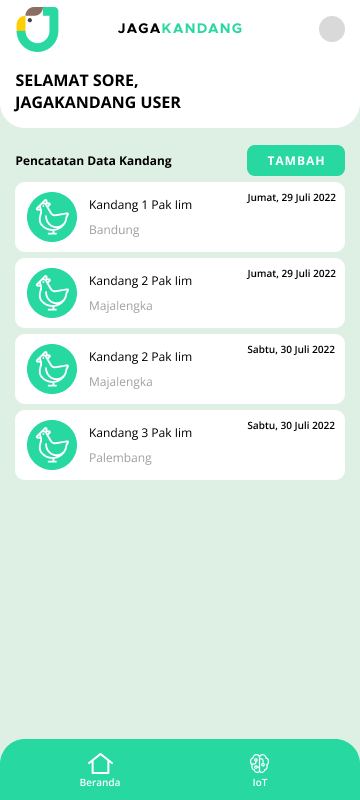
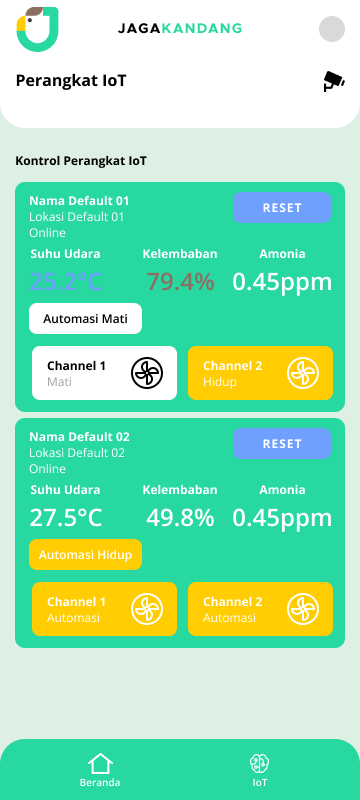
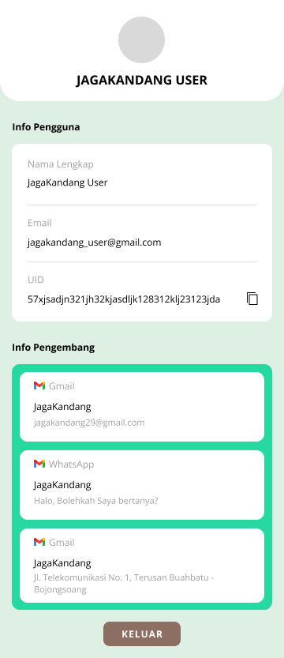
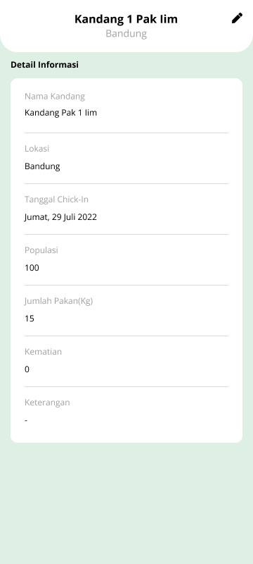
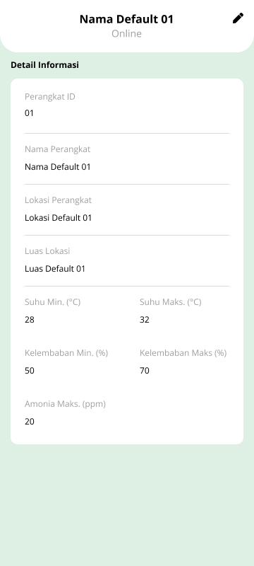

# Jaga Kandang

Jaga Kandang is an Android-based application designed to monitor temperature, humidity, and ammonia gas levels in chicken coops using Internet of Things (IoT) technology. The app integrates with a NodeMCU microcontroller equipped with a DHT22 sensor for measuring temperature and humidity, as well as an MQ-137 sensor for measuring ammonia gas levels in the coop. The application provides real-time data on temperature, humidity, and ammonia levels, allowing poultry farmers to remotely monitor conditions without the need for frequent on-site checks. Additionally, the app sends notifications when temperature, humidity, or ammonia levels deviate from the ideal range.
Login Page                                   | Home Page                                        | Manage IoT Page
---------------------------------------------|--------------------------------------------------|--------------------------------------------
||

Profile Page                                 | Home Detail Page                                 | Manage IoT Detail Page
---------------------------------------------|--------------------------------------------------|--------------------------------------------
||
