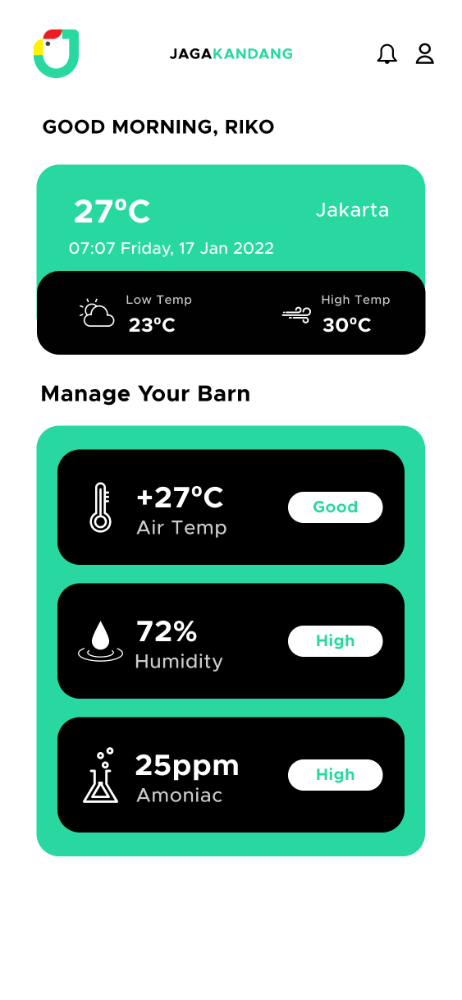
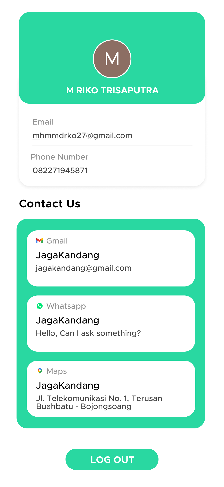

# Jaga Kandang

Repository ini berisikan aplikasi dengan nama Jaga Kandang. Jaga Kandang adalah aplikasi berbasis android yang dapat melakukan pemantauan kondisi suhu, kelembaban serta kadar gas amonia pada kandang ayam dengan memanfaatkan penggunaan teknologi Internet of Things (IoT). Aplikasi ini akan terintegrasi dengan mikrokontroller NodeMCU yang dilengkapi dengan sensor DHT22 yang berguna untuk mengukur suhu dan kelembaban serta sensor MQ-137 yang berguna untuk mengukur kadar gas amonia pada kandang ayam. Aplikasi akan mampu menampilkan secara live suhu, kelembaban serta kadar gas amonia pada kandang ayam. Hal ini sangat berguna bagi pemilik kandang ayam sehingga tidak perlu secara rutin pergi ke kandang untuk memastikan suhu, kelembaban dan kadar gas amonia pada kandang ayam tersebut tetap pada angka yang ideal. Selain itu, aplikasi ini juga akan menampilkan notifikasi jika suhu, kelembaban dan kadar gas amonia pada kandang ayam tidak pada angka yang ideal.

Tampilan Login                               | Tampilan Menu Utama                              | Tampilan Profil
---------------------------------------------|--------------------------------------------------|--------------------------------------------
||

### Link Berkas PA

https://drive.google.com/drive/folders/1yiTOunXgAhAZFAsAKc6swoC7qP52tJnr?usp=sharing

### Susunan Tim

Nama                     | Username Github | Posisi
-------------------------|-----------------|-----------
M Riko Trisaputra        | mhmmdrko        | Mahasiswa
Adelia Nurul Solihah     | adelianurul     | Mahasiswa
Mia Rosmiati, S.Si., MT. | miarosmia       | Pembimbing
Cahyana, ST., M.Kom.     | cahyana78       | Reviewer
